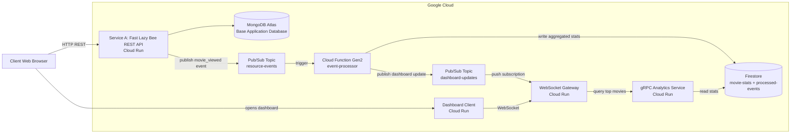

# PCD Cloud Distributed Applications

**Course:** Concurrent and Distributed Programming  
**Selected assignment:** Project 1 - Real-Time Analytics Dashboard

**👥 Team members:**
- Ciorâțanu Maria (MISS11)
- Pâncă Aida-Gabriela (MISS11)
- Varzar Alina-Miruna (MISS11)

This repository contains a distributed cloud application built for the **Concurrent and Distributed Programming** course. The project extends the original **Fast Lazy Bee** REST API into an event-driven analytics system deployed on Google Cloud.

The system collects events when movie resources are accessed, processes them asynchronously, stores aggregated statistics, and updates a live dashboard in real time through WebSocket communication.

---

## ⚙️ 1. Project overview

The goal of this project is to build a distributed cloud application that collects, processes, and displays real-time analytics about resource access.

In this implementation, the monitored resource is a movie from the Fast Lazy Bee API.

When a movie is accessed through:

```text
GET /api/v1/movies/:movie_id
```

the base application publishes a `movie_viewed` event to Google Pub/Sub. The event is then processed asynchronously by a Cloud Function, stored in Firestore, and forwarded to a WebSocket Gateway that updates the dashboard in real time.

The project also includes:

- Google Cloud Run services;
- a Google Cloud Function Gen2 component;
- Google Pub/Sub topics and subscriptions;
- Firestore as the stateful analytics store;
- WebSocket real-time communication;
- gRPC internal communication as a bonus feature;
- backpressure through WebSocket update coalescing;
- latency charts with p50, p95 and p99 metrics;
- benchmark scripts for load, concurrency, consistency and backpressure analysis.

---

## 2. Architecture

The implemented architecture follows the proposed architecture for **Project 1 — Real-Time Analytics Dashboard**.



The system is **event-driven** and **eventually consistent**. The REST API returns the movie response immediately, while the analytics update becomes visible in the dashboard shortly afterward.

---

## 3. Main components

### 3.1 Fast Lazy Bee REST API / Service A

**Location:**

```text
src/
```

**Main modified files:**

```text
src/routes/movies/movie_id/movie-id-routes.ts
src/utils/pubsub-utils.ts
src/schemas/dotenv.ts
```

**Responsibilities:**

- exposes the original Fast Lazy Bee REST API;
- keeps the existing CRUD and authentication functionality;
- reads movie data from MongoDB Atlas;
- publishes a `movie_viewed` event when a movie is accessed through `GET /movies/:movie_id`;
- publishes events to the Pub/Sub topic `resource-events`.

Only `GET` requests generate analytics events. `HEAD` requests are kept for API compatibility but do not generate movie view events.

Example event payload:

```json
{
  "eventId": "generated-uuid",
  "event": "movie_viewed",
  "movieId": "573a1390f29313caabcd42e8",
  "movieTitle": "The Great Train Robbery",
  "accessedAt": "2026-04-26T18:00:00.000Z",
  "viewedAt": "2026-04-26T18:00:00.000Z",
  "source": "fast-lazy-bee"
}
```

---

### 3.2 Cloud Function Gen2 — event-processor

**Location:**

```text
functions/event-processor/
```

**Responsibilities:**

- triggered automatically by messages from the `resource-events` Pub/Sub topic;
- decodes the movie view event;
- updates aggregated movie statistics in Firestore;
- stores processed message identifiers in `processed-events`;
- implements idempotency for Pub/Sub at-least-once delivery;
- publishes processed dashboard updates to the `dashboard-updates` Pub/Sub topic.

**Firestore collections:**

```text
movie-stats
processed-events
```

`movie-stats` stores aggregated analytics per movie.  
`processed-events` stores processed message IDs and prevents duplicate processing.

---

### 3.3 WebSocket Gateway

**Location:**

```text
websocket-gateway/
```

**Responsibilities:**

- runs as a separate Cloud Run service;
- maintains active WebSocket client connections;
- receives processed dashboard events through a Pub/Sub push subscription;
- broadcasts real-time updates to connected dashboard clients;
- exposes runtime endpoints for demo, debugging and benchmarks;
- computes runtime metrics;
- applies backpressure through update coalescing;
- uses gRPC to retrieve top movie statistics from the internal gRPC Analytics Service.

**Important endpoints:**

```text
GET  /health
GET  /snapshot
GET  /metrics
GET  /top-movies
GET  /grpc/top-movies
POST /pubsub/push
POST /debug/reset
POST /debug/close-clients
```

For demo stability, the WebSocket Gateway is deployed with a single Cloud Run instance. This keeps WebSocket connection state inside one instance.

A production-grade multi-instance version would require shared connection state or a fanout mechanism such as Redis, Pub/Sub fanout, sticky sessions or a dedicated real-time messaging layer.

---

### 3.4 gRPC Analytics Service

**Location:**

```text
grpc-analytics-service/
```

**Responsibilities:**

- runs as a separate Cloud Run service;
- exposes an internal gRPC API;
- reads top movie statistics from Firestore;
- is called by the WebSocket Gateway;
- demonstrates internal service-to-service communication through gRPC.

**Proto file:**

```text
grpc-analytics-service/proto/analytics.proto
```

**Implemented RPC methods:**

```text
Health
GetTopMovies
```

The normal `/top-movies` endpoint in the WebSocket Gateway uses gRPC first and falls back to Firestore if the gRPC call fails.

---

### 3.5 Dashboard Client

**Location:**

```text
dashboard-client/
```

**Responsibilities:**

- runs as a separate Cloud Run service;
- serves a minimal frontend implemented with plain HTML, CSS and JavaScript;
- connects to the WebSocket Gateway;
- loads an initial snapshot;
- displays live analytics data.

The dashboard shows:

- WebSocket connection status;
- connected clients;
- total updates;
- total broadcasts;
- coalesced updates;
- latest end-to-end latency;
- p50, p95 and p99 latency;
- real-time latency chart;
- top viewed movies;
- last processed update;
- recent activity;
- reconnect attempts.

The dashboard also reconnects automatically after a WebSocket disconnection.

---

## 4. Cloud services used

The project uses the following cloud-native services:

```text
Google Cloud Run
Google Cloud Functions Gen2
Google Pub/Sub
Google Firestore
Google Cloud Build
Google Artifact Registry
MongoDB Atlas
```

At least one stateful service is used. In this project, Firestore stores analytics state, while MongoDB Atlas stores the base application data.

---

## 5. Pub/Sub topics and subscriptions

### Topics

```text
resource-events
dashboard-updates
```

### Flow

`resource-events` receives movie view events from Service A.

`dashboard-updates` receives processed dashboard updates from the Cloud Function.

The WebSocket Gateway receives messages from `dashboard-updates` through a Pub/Sub push subscription.

---

## 6. Environment variables

### 6.1 Fast Lazy Bee / Service A

```text
MONGO_URL
MONGO_DB_NAME
ENABLE_RESOURCE_EVENTS=true
RESOURCE_EVENTS_TOPIC=resource-events
```

### 6.2 Cloud Function — event-processor

```text
ANALYTICS_COLLECTION=movie-stats
PROCESSED_COLLECTION=processed-events
DASHBOARD_UPDATES_TOPIC=dashboard-updates
```

### 6.3 WebSocket Gateway

```text
ANALYTICS_COLLECTION=movie-stats
TOP_MOVIES_LIMIT=10
BACKPRESSURE_ENABLED=true
BROADCAST_INTERVAL_MS=1000
ENABLE_DEBUG_ENDPOINTS=true
DEBUG_TOKEN=pcd-debug-demo-token
ENABLE_GRPC_ANALYTICS=true
GRPC_ANALYTICS_TARGET=https://grpc-analytics-service-url
GRPC_DEADLINE_MS=2000
```

### 6.4 gRPC Analytics Service

```text
ANALYTICS_COLLECTION=movie-stats
TOP_MOVIES_LIMIT=10
```

### 6.5 Dashboard Client

```text
WS_URL=wss://websocket-gateway-url
```

---

## 7. Repository structure

```text
.github/
  workflows/

dashboard-client/
  app.js
  Dockerfile
  index.html
  package.json
  server.js

functions/
  event-processor/
    .gcloudignore
    index.js
    package.json

grpc-analytics-service/
  proto/
    analytics.proto
  client.js
  Dockerfile
  index.js
  package.json

scripts/
  benchmark-burst.ps1
  benchmark-concurrency.ps1
  benchmark-consistency.ps1
  benchmark-load-series.ps1
  smoke-test.ps1
  verify-cloud-deployment.ps1
  verify-grpc-analytics.ps1

src/
  Fast Lazy Bee REST API source code

websocket-gateway/
  proto/
    analytics.proto
  Dockerfile
  index.js
  package.json

.dockerignore
.env.sample
.gitignore
Dockerfile
package.json
README.md
run.ps1
run.sh
tsconfig.json
```

---

## 8. Prerequisites

The project was developed and tested on Windows using PowerShell.

Required tools:

```text
Node.js
npm
Docker Desktop
Google Cloud SDK
Git
curl.exe
jq
hey
```

The benchmark script for concurrency uses `hey`.

If `hey` is not available globally, it can be passed explicitly:

```powershell
-HeyPath "C:\Users\maria\tools\hey\hey.exe"
```

---

## 9. Local build

From the repository root:

```powershell
cd C:\Users\maria\pcd\project
```

```powershell
npm install
```

```powershell
npm run build
```

Expected result:

```text
The TypeScript project builds successfully.
```

---

## 10. Local syntax checks

The JavaScript services can be checked with:

```powershell
cd C:\Users\maria\pcd\project
```

```powershell
node --check functions/event-processor\index.js
```

```powershell
node --check websocket-gateway\index.js
```

```powershell
node --check dashboard-client\server.js
```

```powershell
node --check dashboard-client\app.js
```

```powershell
node --check grpc-analytics-service\index.js
```

```powershell
node --check grpc-analytics-service\client.js
```

Expected result:

```text
No syntax errors are printed.
```

---

## 11. Cloud deployment

The following commands show the deployment flow used for the main services.

Set common variables:

```powershell
cd C:\Users\maria\pcd\project
```

```powershell
$REGION="us-central1"
```

```powershell
$PROJECT_ID=(gcloud config get-value project)
```

```powershell
$REPO="$REGION-docker.pkg.dev/$PROJECT_ID/myrepo"
```

```powershell
$TAG="final"
```

---

### 11.1 Deploy Fast Lazy Bee / Service A

Run from the repository root:

```powershell
cd C:\Users\maria\pcd\project
```

```powershell
gcloud builds submit --tag "$REPO/fast-lazy-bee:$TAG" .
```

```powershell
gcloud run deploy fast-lazy-bee --image "$REPO/fast-lazy-bee:$TAG" --platform managed --region $REGION --allow-unauthenticated --port 3000 --set-env-vars ENABLE_RESOURCE_EVENTS=true,RESOURCE_EVENTS_TOPIC=resource-events
```

The deployed service also needs `MONGO_URL`, `MONGO_DB_NAME` and the normal Fast Lazy Bee configuration.

---

### 11.2 Deploy Cloud Function Gen2 / event-processor

Run from the repository root:

```powershell
cd C:\Users\maria\pcd\project
```

```powershell
gcloud functions deploy event-processor --gen2 --runtime nodejs22 --region $REGION --source functions/event-processor --entry-point processResourceEvent --trigger-topic resource-events --set-env-vars ANALYTICS_COLLECTION=movie-stats,PROCESSED_COLLECTION=processed-events,DASHBOARD_UPDATES_TOPIC=dashboard-updates
```

---

### 11.3 Deploy gRPC Analytics Service

Run from the service folder:

```powershell
cd C:\Users\maria\pcd\project\grpc-analytics-service
```

```powershell
gcloud builds submit --tag "$REPO/grpc-analytics-service:$TAG" .
```

```powershell
gcloud run deploy grpc-analytics-service --image "$REPO/grpc-analytics-service:$TAG" --platform managed --region $REGION --allow-unauthenticated --port 8080 --use-http2 --set-env-vars ANALYTICS_COLLECTION=movie-stats,TOP_MOVIES_LIMIT=10
```

Get the service URL:

```powershell
$GRPC_ANALYTICS_URL=(gcloud run services describe grpc-analytics-service --region $REGION --format="value(status.url)")
```

---

### 11.4 Deploy WebSocket Gateway

Run from the service folder:

```powershell
cd C:\Users\maria\pcd\project\websocket-gateway
```

```powershell
gcloud builds submit --tag "$REPO/websocket-gateway:$TAG" .
```

```powershell
gcloud run deploy websocket-gateway --image "$REPO/websocket-gateway:$TAG" --platform managed --region $REGION --allow-unauthenticated --port 8080 --min-instances 1 --max-instances 1 --set-env-vars ANALYTICS_COLLECTION=movie-stats,TOP_MOVIES_LIMIT=10,BACKPRESSURE_ENABLED=true,BROADCAST_INTERVAL_MS=1000,ENABLE_DEBUG_ENDPOINTS=true,DEBUG_TOKEN=pcd-debug-demo-token,ENABLE_GRPC_ANALYTICS=true,GRPC_ANALYTICS_TARGET=$GRPC_ANALYTICS_URL,GRPC_DEADLINE_MS=2000
```

Get the WebSocket Gateway URL:

```powershell
$WS_GATEWAY_URL=(gcloud run services describe websocket-gateway --region $REGION --format="value(status.url)")
```

---

### 11.5 Deploy Dashboard Client

Run from the dashboard folder:

```powershell
cd C:\Users\maria\pcd\project\dashboard-client
```

```powershell
$WS_URL=$WS_GATEWAY_URL -replace "^https://","wss://"
```

```powershell
gcloud builds submit --tag "$REPO/dashboard-client:$TAG" .
```

```powershell
gcloud run deploy dashboard-client --image "$REPO/dashboard-client:$TAG" --platform managed --region $REGION --allow-unauthenticated --port 8080 --set-env-vars WS_URL=$WS_URL
```

Get the dashboard URL:

```powershell
$DASHBOARD_URL=(gcloud run services describe dashboard-client --region $REGION --format="value(status.url)")
```

Open it:

```powershell
Start-Process $DASHBOARD_URL
```

---

## 12. Verification scripts

The repository includes scripts that verify the deployed system.

### 12.1 Verify full cloud deployment

```powershell
cd C:\Users\maria\pcd\project
```

```powershell
powershell.exe -ExecutionPolicy Bypass -File .\scripts\verify-cloud-deployment.ps1 -Region "us-central1"
```

This checks:

- Cloud Run services;
- Cloud Function;
- Pub/Sub topics and subscriptions;
- environment variables;
- health endpoints;
- dashboard runtime config;
- gRPC integration;
- debug endpoint protection.

---

### 12.2 Verify gRPC integration

```powershell
cd C:\Users\maria\pcd\project
```

```powershell
powershell.exe -ExecutionPolicy Bypass -File .\scripts\verify-grpc-analytics.ps1 -Region "us-central1"
```

This checks the flow:

```text
websocket-gateway -> gRPC -> grpc-analytics-service -> Firestore
```

---

### 12.3 Smoke test

```powershell
cd C:\Users\maria\pcd\project
```

```powershell
$env:DEBUG_TOKEN="pcd-debug-demo-token"
```

```powershell
powershell.exe -ExecutionPolicy Bypass -File .\scripts\smoke-test.ps1 -Region "us-central1" -MovieId "573a1390f29313caabcd42e8" -WaitSeconds 30
```

This tests the complete flow:

```text
GET /movies/:id
-> Pub/Sub resource-events
-> Cloud Function event-processor
-> Firestore movie-stats
-> Pub/Sub dashboard-updates
-> WebSocket Gateway
-> Dashboard Client
```

---

## 13. Manual functional test

Set service URLs:

```powershell
cd C:\Users\maria\pcd\project
```

```powershell
$REGION="us-central1"
```

```powershell
$FAST_URL=(gcloud run services describe fast-lazy-bee --region $REGION --format="value(status.url)")
```

```powershell
$WS_GATEWAY_URL=(gcloud run services describe websocket-gateway --region $REGION --format="value(status.url)")
```

```powershell
$DASHBOARD_URL=(gcloud run services describe dashboard-client --region $REGION --format="value(status.url)")
```

```powershell
$MOVIE_ID="573a1390f29313caabcd42e8"
```

Trigger a movie view event:

```powershell
curl.exe -s -o NUL -H "Cache-Control: no-cache" "$FAST_URL/api/v1/movies/$MOVIE_ID"
```

Check the WebSocket Gateway snapshot:

```powershell
curl.exe -s "$WS_GATEWAY_URL/snapshot" | jq
```

Open the dashboard:

```powershell
Start-Process $DASHBOARD_URL
```

Expected result:

- `metrics.totalUpdates` increases;
- `lastProcessedUpdate` is populated;
- `topMovies` contains the viewed movie;
- the dashboard updates without refreshing the page.

---

## 14. Runtime endpoints

### Fast Lazy Bee health

```powershell
curl.exe -s "$FAST_URL/api/v1/health" | jq
```

### WebSocket Gateway health

```powershell
curl.exe -s "$WS_GATEWAY_URL/health" | jq
```

### WebSocket Gateway metrics

```powershell
curl.exe -s "$WS_GATEWAY_URL/metrics" | jq
```

### WebSocket Gateway snapshot

```powershell
curl.exe -s "$WS_GATEWAY_URL/snapshot" | jq
```

### Top viewed movies

```powershell
curl.exe -s "$WS_GATEWAY_URL/top-movies" | jq
```

### gRPC top movies through gateway

```powershell
curl.exe -s "$WS_GATEWAY_URL/grpc/top-movies" | jq
```

### Dashboard health

```powershell
curl.exe -s "$DASHBOARD_URL/health" | jq
```

### Dashboard runtime config

```powershell
curl.exe -s "$DASHBOARD_URL/config.js"
```

---

## 15. Debug endpoints

The debug endpoints are enabled only for demo and benchmark reproducibility.

They are protected using the `x-debug-token` header.

### Reset runtime metrics

```powershell
curl.exe -s -X POST -H "Content-Type: application/json" -H "x-debug-token: pcd-debug-demo-token" --data "{}" "$WS_GATEWAY_URL/debug/reset" | jq
```

This clears in-memory gateway state:

- recent activity;
- latency samples;
- total updates;
- total broadcasts;
- coalesced updates;
- last processed update.

It does not delete Firestore data.

### Close WebSocket clients

```powershell
curl.exe -s -X POST -H "Content-Type: application/json" -H "x-debug-token: pcd-debug-demo-token" --data "{}" "$WS_GATEWAY_URL/debug/close-clients" | jq
```

This is used to test dashboard reconnection behavior.

---

## 16. Benchmark scripts

All benchmark results are written to:

```text
benchmark-results/
```

This folder is ignored by Git.

### 16.1 Burst benchmark

```powershell
cd C:\Users\maria\pcd\project
```

```powershell
$REGION="us-central1"
```

```powershell
$MOVIE_ID="573a1390f29313caabcd42e8"
```

```powershell
$env:DEBUG_TOKEN="pcd-debug-demo-token"
```

```powershell
powershell.exe -ExecutionPolicy Bypass -File .\scripts\benchmark-burst.ps1 -Region $REGION -MovieId $MOVIE_ID -Requests 50 -WaitSeconds 25 -OutputDir "benchmark-results"
```

### 16.2 Variable-volume benchmark

```powershell
cd C:\Users\maria\pcd\project
```

```powershell
powershell.exe -ExecutionPolicy Bypass -File .\scripts\benchmark-load-series.ps1 -Region $REGION -MovieId $MOVIE_ID -RequestCounts "10,20,50,100" -WaitSeconds 30 -OutputDir "benchmark-results"
```

### 16.3 Consistency window benchmark

```powershell
cd C:\Users\maria\pcd\project
```

```powershell
powershell.exe -ExecutionPolicy Bypass -File .\scripts\benchmark-consistency.ps1 -Region $REGION -MovieId $MOVIE_ID -Trials 5 -PollIntervalMs 500 -TimeoutSeconds 30 -OutputDir "benchmark-results"
```

### 16.4 Concurrency benchmark

```powershell
cd C:\Users\maria\pcd\project
```

```powershell
powershell.exe -ExecutionPolicy Bypass -File .\scripts\benchmark-concurrency.ps1 -Region $REGION -MovieId $MOVIE_ID -Requests 100 -ConcurrencyLevels "1,5,10,20" -WaitSeconds 45 -OutputDir "benchmark-results"
```

If `hey` is not available globally:

```powershell
powershell.exe -ExecutionPolicy Bypass -File .\scripts\benchmark-concurrency.ps1 -Region $REGION -MovieId $MOVIE_ID -Requests 100 -ConcurrencyLevels "1,5,10,20" -WaitSeconds 45 -OutputDir "benchmark-results" -HeyPath "C:\Users\maria\tools\hey\hey.exe"
```

---

## 17. Final benchmark results

The following results were obtained from the final benchmark run.

### 17.1 Variable-volume benchmark

This benchmark sends sequential movie access requests with increasing total volume.

| Requests | Successful requests | Failed requests | Error rate | Approx. request rate | Total updates | Broadcasts | Coalesced updates | p50 latency | p95 latency | p99 latency |
|---:|---:|---:|---:|---:|---:|---:|---:|---:|---:|---:|
| 10 | 10 | 0 | 0% | 3.76 req/s | 10 | 1 | 9 | 5066 ms | 5893 ms | 5893 ms |
| 20 | 20 | 0 | 0% | 3.89 req/s | 20 | 4 | 16 | 388 ms | 1959 ms | 2299 ms |
| 50 | 50 | 0 | 0% | 3.85 req/s | 50 | 10 | 40 | 181 ms | 1315 ms | 1621 ms |
| 100 | 100 | 0 | 0% | 3.85 req/s | 100 | 23 | 77 | 183 ms | 700 ms | 1166 ms |

The system processed all events successfully. The 10-request run had higher latency because it was affected by warm-up and cloud scheduling effects. After that, the system stabilized and showed lower p95 and p99 latency.

---

### 17.2 Consistency window benchmark

| Metric | Value |
|---|---:|
| Trials | 5 |
| Successful trials | 5 / 5 |
| Average consistency window | 1073.15 ms |
| Minimum consistency window | 1033.68 ms |
| Maximum consistency window | 1154.18 ms |
| Average end-to-end latency | 354.2 ms |
| Average Cloud Function processing latency | 72.2 ms |
| Average gateway latency | 282 ms |

The system is eventually consistent. The API response is returned before the dashboard is updated, but the update becomes visible shortly afterward. In the final run, the average measured consistency window was approximately 1.07 seconds.

---

### 17.3 Concurrency benchmark

This benchmark uses `hey` to send 100 requests with increasing concurrency.

| Concurrency | HTTP 200 responses | Failed requests | Error rate | REST throughput | Total updates | Completion | Broadcasts | Coalesced updates | Dashboard p50 | Dashboard p95 | Dashboard p99 |
|---:|---:|---:|---:|---:|---:|---:|---:|---:|---:|---:|---:|
| 1 | 100 | 0 | 0% | 6.25 req/s | 100 | 100% | 14 | 86 | 258 ms | 1396 ms | 1921 ms |
| 5 | 100 | 0 | 0% | 29.38 req/s | 100 | 100% | 11 | 89 | 4738 ms | 7793 ms | 8370 ms |
| 10 | 100 | 0 | 0% | 58.67 req/s | 100 | 100% | 8 | 92 | 3328 ms | 6026 ms | 6653 ms |
| 20 | 100 | 0 | 0% | 83.08 req/s | 100 | 100% | 9 | 91 | 3250 ms | 7160 ms | 7724 ms |

The REST API remained stable under concurrent access. All requests returned HTTP 200 and all generated events were eventually processed.

The dashboard latency increased under higher concurrency because many events entered the asynchronous pipeline almost at the same time. The WebSocket Gateway reduced the number of broadcasts using backpressure and coalescing.

---

## 18. Interpretation of results

The benchmark results show that:

- the REST API remains stable under load;
- the error rate was 0% in the final benchmark runs;
- no movie view events were lost;
- Pub/Sub and the Cloud Function processed all generated events;
- Firestore aggregation worked correctly;
- the dashboard received all updates;
- backpressure reduced the number of WebSocket broadcasts;
- the system is eventually consistent, with an average consistency window of around 1 second;
- concurrency increases REST throughput, but also increases dashboard-side latency because events are processed asynchronously.

The main bottleneck is not the REST API response time. The main delay appears in the asynchronous analytics path:

```text
Pub/Sub -> Cloud Function -> Firestore -> Pub/Sub -> WebSocket Gateway
```

This is expected for an event-driven system where the API response and analytics update are decoupled.

---

## 19. Bonus features implemented

The project implements all proposed bonus features for Project 1:

### Backpressure

The WebSocket Gateway uses update coalescing. When many events arrive quickly, it keeps the latest state and sends fewer WebSocket broadcasts.

Example from the final concurrency benchmark:

```text
100 updates, concurrency 20
9 WebSocket broadcasts
91 coalesced updates
```

### gRPC internal communication

The WebSocket Gateway calls the gRPC Analytics Service to retrieve top viewed movies.

Verified flow:

```text
websocket-gateway -> gRPC -> grpc-analytics-service -> Firestore
```

### Real-time latency charts

The dashboard includes a real-time latency chart with p50, p95 and p99 overlays.

---

## 20. Resilience

The project includes several resilience mechanisms:

- Pub/Sub decouples Service A from the analytics processor;
- the Cloud Function is idempotent using the `processed-events` Firestore collection;
- the WebSocket Gateway can reconstruct top movie state from Firestore;
- the dashboard reconnects automatically after WebSocket disconnection;
- the WebSocket Gateway falls back to Firestore if the gRPC analytics service is unavailable;
- debug endpoints are protected with a token;
- benchmark scripts reset only in-memory metrics and do not delete persistent Firestore data.

---

## 21. Demo checklist

Before the live demo:

1. Open the deployed dashboard.
2. Show the GitHub repository.
3. Show the architecture diagram from this README.
4. Show the Cloud Run services:
   - `fast-lazy-bee`
   - `websocket-gateway`
   - `dashboard-client`
   - `grpc-analytics-service`
5. Show the Cloud Function:
   - `event-processor`
6. Show the Pub/Sub topics:
   - `resource-events`
   - `dashboard-updates`
7. Show Firestore collections:
   - `movie-stats`
   - `processed-events`
8. Trigger one or more movie view requests from PowerShell.
9. Show the dashboard updating live.
10. Show `/snapshot`.
11. Show `/top-movies`.
12. Show `/grpc/top-movies`.
13. Run or show the benchmark scripts.
14. Explain the consistency window.
15. Explain the backpressure result.
16. Explain the gRPC internal communication.
17. Explain the WebSocket reconnection behavior.

---

## 22. Current project status

Implemented and validated:

```text
Fast Lazy Bee deployed on Cloud Run
Cloud Function Gen2 event-processor deployed
Pub/Sub event flow working
Firestore movie-stats aggregation working
Firestore processed-events idempotency working
WebSocket Gateway deployed on Cloud Run
Dashboard Client deployed on Cloud Run
gRPC Analytics Service deployed on Cloud Run
WebSocket real-time updates working
Dashboard reconnection working
Backpressure working
p50/p95/p99 latency chart working
gRPC internal communication working
Benchmark scripts working
Cloud deployment verification passing
gRPC verification passing
Smoke test passing
```
