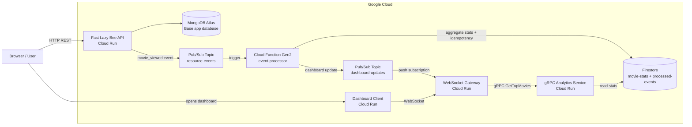

# PCD Cloud Distributed Applications  
## Real-Time Analytics Dashboard

**Course:** Concurrent and Distributed Programming  
**Assignment:** Project 1 - Real-Time Analytics Dashboard  

**Team members:**
- Ciorâțanu Maria - MISS11
- Pâncă Aida-Gabriela - MISS11
- Varzar Alina-Miruna - MISS11

## 1. Project overview

This project extends the **Fast Lazy Bee** REST API into a distributed cloud application for real-time analytics.

When a movie is accessed through:

```text
GET /api/v1/movies/:movie_id
```

the API publishes a `movie_viewed` event to Google Pub/Sub. The event is processed asynchronously by a Cloud Function, stored as aggregated analytics data in Firestore, and then sent to a live dashboard through a WebSocket Gateway.

The dashboard displays live statistics such as top viewed movies, recent activity, connected clients, latency values, p50/p95/p99 latency and WebSocket backpressure metrics.

## 2. Architecture



The architecture separates the synchronous movie API from the asynchronous analytics pipeline, so the REST response is returned immediately while dashboard statistics are updated shortly afterward.

## 3. Prerequisites

The project was developed and tested using Windows PowerShell.

Required tools:
- Git
- Node.js
- npm
- Google Cloud SDK
- Docker Desktop
- `curl.exe`
- `jq`
- `hey`

Required cloud setup:
- Google Cloud project with billing enabled
- MongoDB Atlas cluster with `sample_mflix` imported

Required Google Cloud APIs:
- Cloud Run
- Cloud Functions Gen2
- Cloud Build
- Pub/Sub
- Firestore
- Artifact Registry
- Eventarc

## 4. Environment variables

### Fast Lazy Bee API

```text
NODE_ENV=production
APP_PORT=3000
MONGO_URL=<mongodb-atlas-connection-string>
MONGO_DB_NAME=sample_mflix
ENABLE_RESOURCE_EVENTS=true
RESOURCE_EVENTS_TOPIC=resource-events
```

### Cloud Function

```text
ANALYTICS_COLLECTION=movie-stats
PROCESSED_COLLECTION=processed-events
DASHBOARD_UPDATES_TOPIC=dashboard-updates
```

### WebSocket Gateway

```text
ANALYTICS_COLLECTION=movie-stats
TOP_MOVIES_LIMIT=10
BACKPRESSURE_ENABLED=true
BROADCAST_INTERVAL_MS=1000
ENABLE_DEBUG_ENDPOINTS=true
DEBUG_TOKEN=pcd-debug-demo-token
ENABLE_GRPC_ANALYTICS=true
GRPC_ANALYTICS_TARGET=<grpc-analytics-service-url>
GRPC_DEADLINE_MS=2000
```

### gRPC Analytics Service

```text
ANALYTICS_COLLECTION=movie-stats
TOP_MOVIES_LIMIT=10
```

### Dashboard Client

```text
WS_URL=<websocket-gateway-wss-url>
```

## 5. Local build

From the repository root:

```powershell
cd <project-root>
npm install
npm run build
```

Optional syntax checks for the JavaScript services:

```powershell
node --check functions/event-processor\index.js
node --check websocket-gateway\index.js
node --check dashboard-client\server.js
node --check dashboard-client\app.js
node --check grpc-analytics-service\index.js
node --check grpc-analytics-service\client.js
```

## 6. Google Cloud setup

Set common variables:

```powershell
cd <project-root>

gcloud auth login
gcloud config set project <google-cloud-project-id>

$REGION="us-central1"
$PROJECT_ID=(gcloud config get-value project)
$REPO="$REGION-docker.pkg.dev/$PROJECT_ID/myrepo"
$TAG="final"
```

Enable required APIs:

```powershell
gcloud services enable `
  run.googleapis.com `
  cloudfunctions.googleapis.com `
  cloudbuild.googleapis.com `
  pubsub.googleapis.com `
  firestore.googleapis.com `
  artifactregistry.googleapis.com `
  eventarc.googleapis.com
```

Create the required cloud resources:

```powershell
gcloud config set run/region $REGION

gcloud artifacts repositories create myrepo `
  --repository-format=docker `
  --location=$REGION `
  --description="Docker repository"

gcloud firestore databases create --location=$REGION

gcloud pubsub topics create resource-events
gcloud pubsub topics create dashboard-updates
```

If a resource already exists, the corresponding creation command can be skipped.

## 7. Deploy

### 7.1 Deploy Fast Lazy Bee API

Set the MongoDB Atlas connection string:

```powershell
$MONGO_URL="<mongodb-atlas-connection-string>"
```

Build and deploy:

```powershell
cd <project-root>

gcloud builds submit --tag "$REPO/fast-lazy-bee:$TAG" .

gcloud run deploy fast-lazy-bee `
  --image "$REPO/fast-lazy-bee:$TAG" `
  --platform managed `
  --region $REGION `
  --allow-unauthenticated `
  --port 3000 `
  "--set-env-vars=NODE_ENV=production,APP_PORT=3000,MONGO_URL=$MONGO_URL,MONGO_DB_NAME=sample_mflix,ENABLE_RESOURCE_EVENTS=true,RESOURCE_EVENTS_TOPIC=resource-events"
```

### 7.2 Deploy Cloud Function event-processor

```powershell
cd <project-root>

gcloud functions deploy event-processor `
  --gen2 `
  --runtime nodejs22 `
  --region $REGION `
  --source functions/event-processor `
  --entry-point processResourceEvent `
  --trigger-topic resource-events `
  "--set-env-vars=ANALYTICS_COLLECTION=movie-stats,PROCESSED_COLLECTION=processed-events,DASHBOARD_UPDATES_TOPIC=dashboard-updates"
```

### 7.3 Deploy gRPC Analytics Service

```powershell
cd <project-root>\grpc-analytics-service

gcloud builds submit --tag "$REPO/grpc-analytics-service:$TAG" .

gcloud run deploy grpc-analytics-service `
  --image "$REPO/grpc-analytics-service:$TAG" `
  --platform managed `
  --region $REGION `
  --allow-unauthenticated `
  --port 8080 `
  --use-http2 `
  "--set-env-vars=ANALYTICS_COLLECTION=movie-stats,TOP_MOVIES_LIMIT=10"
```

Read the service URL:

```powershell
$GRPC_ANALYTICS_URL=(gcloud run services describe grpc-analytics-service --region $REGION --format="value(status.url)")
```

### 7.4 Deploy WebSocket Gateway

```powershell
cd <project-root>\websocket-gateway

gcloud builds submit --tag "$REPO/websocket-gateway:$TAG" .

gcloud run deploy websocket-gateway `
  --image "$REPO/websocket-gateway:$TAG" `
  --platform managed `
  --region $REGION `
  --allow-unauthenticated `
  --port 8080 `
  --min-instances 1 `
  --max-instances 1 `
  "--set-env-vars=ANALYTICS_COLLECTION=movie-stats,TOP_MOVIES_LIMIT=10,BACKPRESSURE_ENABLED=true,BROADCAST_INTERVAL_MS=1000,ENABLE_DEBUG_ENDPOINTS=true,DEBUG_TOKEN=pcd-debug-demo-token,ENABLE_GRPC_ANALYTICS=true,GRPC_ANALYTICS_TARGET=$GRPC_ANALYTICS_URL,GRPC_DEADLINE_MS=2000"
```

Read the gateway URL:

```powershell
$WS_GATEWAY_URL=(gcloud run services describe websocket-gateway --region $REGION --format="value(status.url)")
```

Create the push subscription for dashboard updates:

```powershell
gcloud pubsub subscriptions create dashboard-updates-sub `
  --topic=dashboard-updates `
  --push-endpoint="$WS_GATEWAY_URL/pubsub/push" `
  --ack-deadline=30
```

If the subscription already exists, update it:

```powershell
gcloud pubsub subscriptions update dashboard-updates-sub `
  --push-endpoint="$WS_GATEWAY_URL/pubsub/push" `
  --ack-deadline=30
```

### 7.5 Deploy Dashboard Client

```powershell
$WS_URL=$WS_GATEWAY_URL -replace "^https://","wss://"
```

```powershell
cd <project-root>\dashboard-client

gcloud builds submit --tag "$REPO/dashboard-client:$TAG" .

gcloud run deploy dashboard-client `
  --image "$REPO/dashboard-client:$TAG" `
  --platform managed `
  --region $REGION `
  --allow-unauthenticated `
  --port 8080 `
  "--set-env-vars=WS_URL=$WS_URL"
```

Read and open the dashboard URL:

```powershell
$DASHBOARD_URL=(gcloud run services describe dashboard-client --region $REGION --format="value(status.url)")
Start-Process $DASHBOARD_URL
```

## 8. Test and verify

### 8.1 Full deployment verification

```powershell
cd <project-root>

powershell.exe -ExecutionPolicy Bypass -File .\scripts\verify-cloud-deployment.ps1 -Region "us-central1"
```

This verifies the deployed services, Pub/Sub topics and subscriptions, environment variables, health endpoints, dashboard configuration, gRPC integration and debug endpoint protection.

### 8.2 gRPC verification

```powershell
cd <project-root>

powershell.exe -ExecutionPolicy Bypass -File .\scripts\verify-grpc-analytics.ps1 -Region "us-central1"
```

This verifies the internal path:

```text
websocket-gateway -> gRPC -> grpc-analytics-service -> Firestore
```

### 8.3 Smoke test

```powershell
cd <project-root>

$REGION="us-central1"
$MOVIE_ID="573a1390f29313caabcd42e8"
$env:DEBUG_TOKEN="pcd-debug-demo-token"

powershell.exe -ExecutionPolicy Bypass -File .\scripts\smoke-test.ps1 `
  -Region $REGION `
  -MovieId $MOVIE_ID `
  -WaitSeconds 30
```

This test checks that a movie access event passes through the distributed pipeline and becomes visible in the gateway/dashboard state.

## 9. Manual test commands

Set URLs:

```powershell
$REGION="us-central1"
$MOVIE_ID="573a1390f29313caabcd42e8"

$FAST_URL=(gcloud run services describe fast-lazy-bee --region $REGION --format="value(status.url)")
$WS_GATEWAY_URL=(gcloud run services describe websocket-gateway --region $REGION --format="value(status.url)")
$DASHBOARD_URL=(gcloud run services describe dashboard-client --region $REGION --format="value(status.url)")
```

Check health:

```powershell
curl.exe -s "$FAST_URL/api/v1/health" | jq
curl.exe -s "$WS_GATEWAY_URL/health" | jq
curl.exe -s "$DASHBOARD_URL/health" | jq
```

Trigger a movie view event:

```powershell
curl.exe -s -o NUL -H "Cache-Control: no-cache" "$FAST_URL/api/v1/movies/$MOVIE_ID"
```

Check gateway state and metrics:

```powershell
curl.exe -s "$WS_GATEWAY_URL/snapshot" | jq
curl.exe -s "$WS_GATEWAY_URL/metrics" | jq
```

Check top movies and the gRPC path through the gateway:

```powershell
curl.exe -s "$WS_GATEWAY_URL/top-movies" | jq
curl.exe -s "$WS_GATEWAY_URL/grpc/top-movies" | jq
```

Open the dashboard:

```powershell
Start-Process $DASHBOARD_URL
```

## 10. Benchmark commands

Set common variables:

```powershell
cd <project-root>

$REGION="us-central1"
$MOVIE_ID="573a1390f29313caabcd42e8"
$env:DEBUG_TOKEN="pcd-debug-demo-token"
```

Variable-volume benchmark:

```powershell
powershell.exe -ExecutionPolicy Bypass -File .\scripts\benchmark-load-series.ps1 `
  -Region $REGION `
  -MovieId $MOVIE_ID `
  -RequestCounts "10,20,50,100" `
  -WaitSeconds 30 `
  -OutputDir "benchmark-results"
```

Consistency window benchmark:

```powershell
powershell.exe -ExecutionPolicy Bypass -File .\scripts\benchmark-consistency.ps1 `
  -Region $REGION `
  -MovieId $MOVIE_ID `
  -Trials 5 `
  -PollIntervalMs 500 `
  -TimeoutSeconds 30 `
  -OutputDir "benchmark-results"
```

Concurrency benchmark:

```powershell
powershell.exe -ExecutionPolicy Bypass -File .\scripts\benchmark-concurrency.ps1 `
  -Region $REGION `
  -MovieId $MOVIE_ID `
  -Requests 100 `
  -ConcurrencyLevels "1,5,10,20" `
  -WaitSeconds 45 `
  -OutputDir "benchmark-results"
```

Benchmark outputs are saved in:

```text
benchmark-results/
```

## 11. Final benchmark summary

The final benchmark files used for the report are:

```text
benchmark-results/load-series-summary-20260426-214858.csv
benchmark-results/consistency-summary-20260426-214138.csv
benchmark-results/concurrency-summary-20260426-215325.csv
```

Summary:

| Benchmark | Result |
|---|---|
| Variable-volume benchmark | 10, 20, 50 and 100 requests were processed with 0% errors and 100% completion. |
| Consistency benchmark | 5 / 5 successful trials, average consistency window 1073.15 ms. |
| Concurrency benchmark | 100 requests per run, concurrency 1 / 5 / 10 / 20, all with 0% errors and 100% processing completion. |
| Best measured REST throughput | 83.08 requests/second at concurrency 20. |
| Backpressure example | At concurrency 20, 100 processed updates resulted in 9 WebSocket broadcasts and 91 coalesced updates. |
