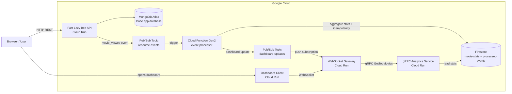

# PCD Cloud Distributed Applications  
## Real-Time Analytics Dashboard

**Course:** Concurrent and Distributed Programming  
**Assignment:** Project 1 - Real-Time Analytics Dashboard  

**Team members:**
- Ciorâțanu Maria - MISS11
- Pâncă Aida-Gabriela - MISS11
- Varzar Alina-Miruna - MISS11

---

## 1. Project overview

This project extends the **Fast Lazy Bee** REST API into a distributed cloud application for real-time analytics.

The system tracks movie accesses from the base API. When a movie is requested through:

```text
GET /api/v1/movies/:movie_id
```

the application publishes a `movie_viewed` event to Google Pub/Sub. The event is processed asynchronously by a Cloud Function, stored as aggregated analytics data in Firestore, and then forwarded to a live dashboard through a WebSocket Gateway.

The dashboard displays:

- top viewed movies
- recent movie access activity
- number of connected dashboard clients
- end-to-end latency
- p50, p95 and p99 latency
- WebSocket broadcast metrics
- backpressure/coalescing metrics

The system is **event-driven** and **eventually consistent**. The REST API returns the movie response immediately, while the analytics update appears in the dashboard shortly afterward.

---

## 2. Architecture



Main event flow:

```text
GET /api/v1/movies/:movie_id
-> Fast Lazy Bee publishes movie_viewed event
-> Pub/Sub topic resource-events
-> Cloud Function Gen2 event-processor
-> Firestore aggregation
-> Pub/Sub topic dashboard-updates
-> WebSocket Gateway
-> Dashboard Client
```

---

## 3. Implemented components

| Component | Deployment type | Role |
|---|---|---|
| **Fast Lazy Bee API** | Cloud Run | Base REST API. Publishes a `movie_viewed` event when a movie is accessed. |
| **event-processor** | Cloud Function Gen2 | Processes Pub/Sub events, updates Firestore statistics and implements idempotency. |
| **WebSocket Gateway** | Cloud Run | Receives dashboard updates and broadcasts them to connected WebSocket clients. |
| **Dashboard Client** | Cloud Run | Minimal HTML/CSS/JavaScript frontend for live analytics. |
| **gRPC Analytics Service** | Cloud Run | Internal gRPC service used by the gateway to read top movie statistics from Firestore. |

The project uses more than the minimum required number of independently deployed components.

---

## 4. Cloud services used

| Cloud service | Usage |
|---|---|
| **Google Cloud Run** | Runs Fast Lazy Bee, WebSocket Gateway, Dashboard Client and gRPC Analytics Service. |
| **Google Cloud Functions Gen2** | Runs the FaaS event processor. |
| **Google Pub/Sub** | Connects services asynchronously through event topics. |
| **Google Firestore** | Stateful analytics storage for movie statistics and processed event IDs. |
| **Google Cloud Build** | Builds container images. |
| **Google Artifact Registry** | Stores container images. |
| **MongoDB Atlas** | Stores the original Fast Lazy Bee movie data. |

Firestore is the stateful analytics store. MongoDB Atlas remains the operational database of the original Fast Lazy Bee application.

---

## 5. Main implementation details

### 5.1 Fast Lazy Bee / Service A

Main modified files:

```text
src/routes/movies/movie_id/movie-id-routes.ts
src/utils/pubsub-utils.ts
src/schemas/dotenv.ts
```

Responsibilities:

- keeps the original Fast Lazy Bee REST API functionality
- reads movie data from MongoDB Atlas
- publishes a `movie_viewed` event when a movie is accessed through `GET /api/v1/movies/:movie_id`
- publishes events to the Pub/Sub topic `resource-events`
- uses environment variables to enable or disable event publishing

Only `GET` requests generate analytics events. `HEAD` requests remain supported for API compatibility, but they do not publish movie view events.

Example event payload:

```json
{
  "eventId": "generated-uuid",
  "event": "movie_viewed",
  "movieId": "573a1390f29313caabcd42e8",
  "movieTitle": "The Great Train Robbery",
  "accessedAt": "2026-04-26T18:00:00.000Z",
  "viewedAt": "2026-04-26T18:00:00.000Z",
  "source": "fast-lazy-bee"
}
```

The event publishing is fire-and-forget. If publishing fails, the error is logged, but the REST response is not blocked by the analytics pipeline.

---

### 5.2 Cloud Function Gen2 - event-processor

Location:

```text
functions/event-processor/
```

Responsibilities:

- triggered by messages from the `resource-events` Pub/Sub topic
- decodes the movie view event
- updates aggregated movie statistics in Firestore
- stores processed message identifiers in `processed-events`
- implements idempotency for Pub/Sub at-least-once delivery
- publishes processed dashboard updates to the `dashboard-updates` Pub/Sub topic

Firestore collections:

```text
movie-stats
processed-events
```

`movie-stats` stores aggregated analytics per movie.  
`processed-events` stores processed message IDs and prevents duplicate processing of the same Pub/Sub delivery.

---

### 5.3 WebSocket Gateway

Location:

```text
websocket-gateway/
```

Responsibilities:

- maintains WebSocket connections with dashboard clients
- receives processed dashboard events through a Pub/Sub push subscription
- broadcasts real-time updates to connected clients
- exposes runtime metrics through HTTP endpoints
- applies backpressure through update coalescing
- retrieves top movies through the gRPC Analytics Service
- falls back to Firestore/memory if the gRPC path is unavailable

Important endpoints:

```text
GET  /health
GET  /snapshot
GET  /metrics
GET  /top-movies
GET  /grpc/top-movies
POST /pubsub/push
POST /debug/reset
POST /debug/close-clients
```

The WebSocket Gateway is deployed with one Cloud Run instance for demo stability, because WebSocket connections are stateful inside the gateway process.

---

### 5.4 gRPC Analytics Service

Location:

```text
grpc-analytics-service/
```

Responsibilities:

- exposes an internal gRPC API
- reads top movie statistics from Firestore
- is called by the WebSocket Gateway
- demonstrates internal service-to-service communication

Implemented RPC methods:

```text
Health
GetTopMovies
```

Proto file:

```text
grpc-analytics-service/proto/analytics.proto
```

The WebSocket Gateway uses gRPC as the primary path for retrieving top movies. If the gRPC call fails, the gateway falls back to Firestore.

---

### 5.5 Dashboard Client

Location:

```text
dashboard-client/
```

Responsibilities:

- serves a minimal frontend implemented with HTML, CSS and JavaScript
- connects to the WebSocket Gateway
- loads an initial snapshot
- receives live updates through WebSocket
- automatically reconnects if the WebSocket connection is closed

The dashboard displays:

- connection status
- connected clients
- total updates
- total broadcasts
- coalesced updates
- latest end-to-end latency
- p50, p95 and p99 latency
- real-time latency chart
- top viewed movies
- recent activity
- last processed update

---

## 6. Repository structure

```text
dashboard-client/
  app.js
  Dockerfile
  index.html
  package.json
  server.js

functions/
  event-processor/
    .gcloudignore
    index.js
    package.json

grpc-analytics-service/
  proto/
    analytics.proto
  client.js
  Dockerfile
  index.js
  package.json

scripts/
  benchmark-burst.ps1
  benchmark-concurrency.ps1
  benchmark-consistency.ps1
  benchmark-load-series.ps1
  smoke-test.ps1
  verify-cloud-deployment.ps1
  verify-grpc-analytics.ps1

src/
  Fast Lazy Bee REST API source code

websocket-gateway/
  proto/
    analytics.proto
  Dockerfile
  index.js
  package.json

.env.sample
.gitignore
Dockerfile
package.json
README.md
run.ps1
run.sh
tsconfig.json
```

---

## 7. Prerequisites

The project was developed and tested mainly on Windows using PowerShell.

Required tools:

```text
Git
Node.js
npm
Docker Desktop
Google Cloud SDK
curl.exe
jq
hey
```

Google Cloud requirements:

```text
Google Cloud project
Billing enabled
Cloud Run API
Cloud Functions API
Cloud Build API
Pub/Sub API
Firestore API
Artifact Registry API
Eventarc API
```

External database:

```text
MongoDB Atlas cluster with the sample_mflix database imported
```

The MongoDB Atlas connection string is required during deployment.

---

## 8. Environment variables

### 8.1 Fast Lazy Bee / Service A

```text
NODE_ENV=production
APP_PORT=3000
MONGO_URL=<mongodb-atlas-connection-string>
MONGO_DB_NAME=sample_mflix
ENABLE_RESOURCE_EVENTS=true
RESOURCE_EVENTS_TOPIC=resource-events
```

### 8.2 Cloud Function - event-processor

```text
ANALYTICS_COLLECTION=movie-stats
PROCESSED_COLLECTION=processed-events
DASHBOARD_UPDATES_TOPIC=dashboard-updates
```

### 8.3 WebSocket Gateway

```text
ANALYTICS_COLLECTION=movie-stats
TOP_MOVIES_LIMIT=10
BACKPRESSURE_ENABLED=true
BROADCAST_INTERVAL_MS=1000
ENABLE_DEBUG_ENDPOINTS=true
DEBUG_TOKEN=pcd-debug-demo-token
ENABLE_GRPC_ANALYTICS=true
GRPC_ANALYTICS_TARGET=<grpc-analytics-service-url>
GRPC_DEADLINE_MS=2000
```

### 8.4 gRPC Analytics Service

```text
ANALYTICS_COLLECTION=movie-stats
TOP_MOVIES_LIMIT=10
```

### 8.5 Dashboard Client

```text
WS_URL=<websocket-gateway-wss-url>
```

---

## 9. Local build and syntax checks

From the repository root:

```powershell
cd <project-root>
npm install
npm run build
```

Expected result:

```text
The TypeScript project builds successfully.
```

Optional JavaScript syntax checks:

```powershell
node --check functions/event-processor\index.js
node --check websocket-gateway\index.js
node --check dashboard-client\server.js
node --check dashboard-client\app.js
node --check grpc-analytics-service\index.js
node --check grpc-analytics-service\client.js
```

Expected result:

```text
No syntax errors are printed.
```

---

## 10. Google Cloud resource setup

Set common variables:

```powershell
cd <project-root>

$REGION="us-central1"
$PROJECT_ID=(gcloud config get-value project)
$REPO="$REGION-docker.pkg.dev/$PROJECT_ID/myrepo"
$TAG="final"
```

Enable required APIs:

```powershell
gcloud services enable `
  run.googleapis.com `
  cloudfunctions.googleapis.com `
  cloudbuild.googleapis.com `
  pubsub.googleapis.com `
  firestore.googleapis.com `
  artifactregistry.googleapis.com `
  eventarc.googleapis.com
```

Set the Cloud Run region:

```powershell
gcloud config set run/region $REGION
```

Create the Artifact Registry repository:

```powershell
gcloud artifacts repositories create myrepo `
  --repository-format=docker `
  --location=$REGION `
  --description="Docker repository"
```

Create the Firestore database:

```powershell
gcloud firestore databases create --location=$REGION
```

Create Pub/Sub topics:

```powershell
gcloud pubsub topics create resource-events
gcloud pubsub topics create dashboard-updates
```

---

## 11. Cloud deployment

### 11.1 Deploy Fast Lazy Bee / Service A

Set the MongoDB Atlas URL before deploying:

```powershell
$MONGO_URL="<mongodb-atlas-connection-string>"
```

Build and deploy the main service:

```powershell
cd <project-root>

gcloud builds submit --tag "$REPO/fast-lazy-bee:$TAG" .

gcloud run deploy fast-lazy-bee `
  --image "$REPO/fast-lazy-bee:$TAG" `
  --platform managed `
  --region $REGION `
  --allow-unauthenticated `
  --port 3000 `
  "--set-env-vars=NODE_ENV=production,APP_PORT=3000,MONGO_URL=$MONGO_URL,MONGO_DB_NAME=sample_mflix,ENABLE_RESOURCE_EVENTS=true,RESOURCE_EVENTS_TOPIC=resource-events"
```

---

### 11.2 Deploy Cloud Function Gen2 / event-processor

```powershell
cd <project-root>

gcloud functions deploy event-processor `
  --gen2 `
  --runtime nodejs22 `
  --region $REGION `
  --source functions/event-processor `
  --entry-point processResourceEvent `
  --trigger-topic resource-events `
  "--set-env-vars=ANALYTICS_COLLECTION=movie-stats,PROCESSED_COLLECTION=processed-events,DASHBOARD_UPDATES_TOPIC=dashboard-updates"
```

---

### 11.3 Deploy gRPC Analytics Service

```powershell
cd <project-root>\grpc-analytics-service

gcloud builds submit --tag "$REPO/grpc-analytics-service:$TAG" .

gcloud run deploy grpc-analytics-service `
  --image "$REPO/grpc-analytics-service:$TAG" `
  --platform managed `
  --region $REGION `
  --allow-unauthenticated `
  --port 8080 `
  --use-http2 `
  "--set-env-vars=ANALYTICS_COLLECTION=movie-stats,TOP_MOVIES_LIMIT=10"
```

Read the deployed service URL:

```powershell
$GRPC_ANALYTICS_URL=(gcloud run services describe grpc-analytics-service --region $REGION --format="value(status.url)")
```

---

### 11.4 Deploy WebSocket Gateway

```powershell
cd <project-root>\websocket-gateway

gcloud builds submit --tag "$REPO/websocket-gateway:$TAG" .

gcloud run deploy websocket-gateway `
  --image "$REPO/websocket-gateway:$TAG" `
  --platform managed `
  --region $REGION `
  --allow-unauthenticated `
  --port 8080 `
  --min-instances 1 `
  --max-instances 1 `
  "--set-env-vars=ANALYTICS_COLLECTION=movie-stats,TOP_MOVIES_LIMIT=10,BACKPRESSURE_ENABLED=true,BROADCAST_INTERVAL_MS=1000,ENABLE_DEBUG_ENDPOINTS=true,DEBUG_TOKEN=pcd-debug-demo-token,ENABLE_GRPC_ANALYTICS=true,GRPC_ANALYTICS_TARGET=$GRPC_ANALYTICS_URL,GRPC_DEADLINE_MS=2000"
```

Read the deployed gateway URL:

```powershell
$WS_GATEWAY_URL=(gcloud run services describe websocket-gateway --region $REGION --format="value(status.url)")
```

Create the Pub/Sub push subscription that sends dashboard updates to the WebSocket Gateway:

```powershell
gcloud pubsub subscriptions create dashboard-updates-sub `
  --topic=dashboard-updates `
  --push-endpoint="$WS_GATEWAY_URL/pubsub/push" `
  --ack-deadline=30
```

If the subscription already exists, update it instead:

```powershell
gcloud pubsub subscriptions update dashboard-updates-sub `
  --push-endpoint="$WS_GATEWAY_URL/pubsub/push" `
  --ack-deadline=30
```

---

### 11.5 Deploy Dashboard Client

Convert the HTTPS gateway URL to a WebSocket URL:

```powershell
$WS_URL=$WS_GATEWAY_URL -replace "^https://","wss://"
```

Build and deploy the dashboard:

```powershell
cd <project-root>\dashboard-client

gcloud builds submit --tag "$REPO/dashboard-client:$TAG" .

gcloud run deploy dashboard-client `
  --image "$REPO/dashboard-client:$TAG" `
  --platform managed `
  --region $REGION `
  --allow-unauthenticated `
  --port 8080 `
  "--set-env-vars=WS_URL=$WS_URL"
```

Read and open the dashboard URL:

```powershell
$DASHBOARD_URL=(gcloud run services describe dashboard-client --region $REGION --format="value(status.url)")
Start-Process $DASHBOARD_URL
```

---

## 12. Testing and verification

### 12.1 Full cloud deployment verification

```powershell
cd <project-root>

powershell.exe -ExecutionPolicy Bypass -File .\scripts\verify-cloud-deployment.ps1 -Region "us-central1"
```

This script checks:

- Cloud Run services
- Cloud Function Gen2
- Pub/Sub topics and subscriptions
- required environment variables
- health endpoints
- dashboard runtime config
- WebSocket Gateway `/metrics` and `/snapshot`
- gRPC integration
- debug endpoint protection

---

### 12.2 gRPC verification

```powershell
cd <project-root>

powershell.exe -ExecutionPolicy Bypass -File .\scripts\verify-grpc-analytics.ps1 -Region "us-central1"
```

This validates the internal communication path:

```text
websocket-gateway -> gRPC -> grpc-analytics-service -> Firestore
```

---

### 12.3 Smoke test

```powershell
cd <project-root>

$REGION="us-central1"
$MOVIE_ID="573a1390f29313caabcd42e8"
$env:DEBUG_TOKEN="pcd-debug-demo-token"

powershell.exe -ExecutionPolicy Bypass -File .\scripts\smoke-test.ps1 `
  -Region $REGION `
  -MovieId $MOVIE_ID `
  -WaitSeconds 30
```

The smoke test validates the complete pipeline:

```text
REST request
-> Pub/Sub resource-events
-> Cloud Function event-processor
-> Firestore movie-stats
-> Pub/Sub dashboard-updates
-> WebSocket Gateway
-> Dashboard state
```

Expected result:

```text
Smoke test completed successfully
```

---

## 13. Manual runtime commands

Set common runtime variables:

```powershell
cd <project-root>

$REGION="us-central1"
$MOVIE_ID="573a1390f29313caabcd42e8"

$FAST_URL=(gcloud run services describe fast-lazy-bee --region $REGION --format="value(status.url)")
$WS_GATEWAY_URL=(gcloud run services describe websocket-gateway --region $REGION --format="value(status.url)")
$DASHBOARD_URL=(gcloud run services describe dashboard-client --region $REGION --format="value(status.url)")
```

Check service health:

```powershell
curl.exe -s "$FAST_URL/api/v1/health" | jq
curl.exe -s "$WS_GATEWAY_URL/health" | jq
curl.exe -s "$DASHBOARD_URL/health" | jq
```

Trigger one movie view event:

```powershell
curl.exe -s -o NUL -H "Cache-Control: no-cache" "$FAST_URL/api/v1/movies/$MOVIE_ID"
```

Check the gateway snapshot:

```powershell
curl.exe -s "$WS_GATEWAY_URL/snapshot" | jq
```

Check runtime metrics:

```powershell
curl.exe -s "$WS_GATEWAY_URL/metrics" | jq
```

Check top movies:

```powershell
curl.exe -s "$WS_GATEWAY_URL/top-movies" | jq
```

Check top movies through the gRPC path:

```powershell
curl.exe -s "$WS_GATEWAY_URL/grpc/top-movies" | jq
```

Open the dashboard:

```powershell
Start-Process $DASHBOARD_URL
```

---

## 14. Debug endpoints

The debug endpoints are used only for demo and benchmark reproducibility. They are protected with the `x-debug-token` header.

Set the debug token:

```powershell
$env:DEBUG_TOKEN="pcd-debug-demo-token"
```

Reset in-memory gateway metrics:

```powershell
curl.exe -s -X POST `
  -H "Content-Type: application/json" `
  -H "x-debug-token: $env:DEBUG_TOKEN" `
  --data "{}" `
  "$WS_GATEWAY_URL/debug/reset" | jq
```

This resets in-memory gateway state, but does not delete Firestore data.

Close connected WebSocket clients to test dashboard reconnection:

```powershell
curl.exe -s -X POST `
  -H "Content-Type: application/json" `
  -H "x-debug-token: $env:DEBUG_TOKEN" `
  --data "{}" `
  "$WS_GATEWAY_URL/debug/close-clients" | jq
```

Expected result is that the dashboard reconnects automatically.

---

## 15. Benchmark commands

All benchmark results are saved in:

```text
benchmark-results/
```

Set common variables:

```powershell
cd <project-root>

$REGION="us-central1"
$MOVIE_ID="573a1390f29313caabcd42e8"
$env:DEBUG_TOKEN="pcd-debug-demo-token"
```

### 15.1 Burst benchmark

```powershell
powershell.exe -ExecutionPolicy Bypass -File .\scripts\benchmark-burst.ps1 `
  -Region $REGION `
  -MovieId $MOVIE_ID `
  -Requests 100 `
  -WaitSeconds 30 `
  -OutputDir "benchmark-results"
```

### 15.2 Variable-volume benchmark

```powershell
powershell.exe -ExecutionPolicy Bypass -File .\scripts\benchmark-load-series.ps1 `
  -Region $REGION `
  -MovieId $MOVIE_ID `
  -RequestCounts "10,20,50,100" `
  -WaitSeconds 30 `
  -OutputDir "benchmark-results"
```

### 15.3 Consistency window benchmark

```powershell
powershell.exe -ExecutionPolicy Bypass -File .\scripts\benchmark-consistency.ps1 `
  -Region $REGION `
  -MovieId $MOVIE_ID `
  -Trials 5 `
  -PollIntervalMs 500 `
  -TimeoutSeconds 30 `
  -OutputDir "benchmark-results"
```

### 15.4 Concurrency benchmark

```powershell
powershell.exe -ExecutionPolicy Bypass -File .\scripts\benchmark-concurrency.ps1 `
  -Region $REGION `
  -MovieId $MOVIE_ID `
  -Requests 100 `
  -ConcurrencyLevels "1,5,10,20" `
  -WaitSeconds 45 `
  -OutputDir "benchmark-results"
```

```powershell
powershell.exe -ExecutionPolicy Bypass -File .\scripts\benchmark-concurrency.ps1 `
  -Region $REGION `
  -MovieId $MOVIE_ID `
  -Requests 100 `
  -ConcurrencyLevels "1,5,10,20" `
  -WaitSeconds 45 `
  -OutputDir "benchmark-results" `
  -HeyPath "C:\path\to\hey.exe"
```

---

## 16. Final benchmark results

The following values were obtained from the final benchmark run stored in `benchmark-results/`.

### 16.1 Variable-volume benchmark

Source files:

```text
benchmark-results/load-series-summary-20260426-214858.csv
benchmark-results/load-series-summary-20260426-214858.json
```

| Requests | Successful | Failed | Error rate | Req/s | Updates | Completion | Broadcasts | Coalesced | p50 latency | p95 latency | p99 latency |
|---:|---:|---:|---:|---:|---:|---:|---:|---:|---:|---:|---:|
| 10 | 10 | 0 | 0% | 3.76 | 10 | 100% | 1 | 9 | 5066 ms | 5893 ms | 5893 ms |
| 20 | 20 | 0 | 0% | 3.89 | 20 | 100% | 4 | 16 | 388 ms | 1959 ms | 2299 ms |
| 50 | 50 | 0 | 0% | 3.85 | 50 | 100% | 10 | 40 | 181 ms | 1315 ms | 1621 ms |
| 100 | 100 | 0 | 0% | 3.85 | 100 | 100% | 23 | 77 | 183 ms | 700 ms | 1166 ms |

All requests returned HTTP 200 and all generated events were processed. The number of WebSocket broadcasts is lower than the number of processed updates because the gateway coalesces updates when events arrive quickly.

---

### 16.2 Consistency window benchmark

Source files:

```text
benchmark-results/consistency-20260426-214138.json
benchmark-results/consistency-trials-20260426-214138.csv
benchmark-results/consistency-summary-20260426-214138.csv
```

| Metric | Value |
|---|---:|
| Trials | 5 |
| Successful trials | 5 / 5 |
| Average consistency window | 1073.15 ms |
| Minimum consistency window | 1033.68 ms |
| Maximum consistency window | 1154.18 ms |
| Average end-to-end latency | 354.2 ms |
| Average Cloud Function processing latency | 72.2 ms |
| Average gateway latency | 282 ms |

The system is eventually consistent. The API response is returned first, and the dashboard update becomes visible shortly afterward. In the final consistency benchmark, the average measured consistency window was about 1.07 seconds.

---

### 16.3 Concurrency benchmark

Source files:

```text
benchmark-results/concurrency-summary-20260426-215325.csv
benchmark-results/concurrency-summary-20260426-215325.json
```

| Concurrency | HTTP 200 | Failed | Error rate | REST req/s | Updates | Completion | Broadcasts | Coalesced | Dashboard p50 | Dashboard p95 | Dashboard p99 |
|---:|---:|---:|---:|---:|---:|---:|---:|---:|---:|---:|---:|
| 1 | 100 | 0 | 0% | 6.25 | 100 | 100% | 14 | 86 | 258 ms | 1396 ms | 1921 ms |
| 5 | 100 | 0 | 0% | 29.38 | 100 | 100% | 11 | 89 | 4738 ms | 7793 ms | 8370 ms |
| 10 | 100 | 0 | 0% | 58.67 | 100 | 100% | 8 | 92 | 3328 ms | 6026 ms | 6653 ms |
| 20 | 100 | 0 | 0% | 83.08 | 100 | 100% | 9 | 91 | 3250 ms | 7160 ms | 7724 ms |

The REST API remained stable under concurrent access. All requests returned HTTP 200 and all generated events were eventually processed. The REST throughput increased from 6.25 requests/second at concurrency 1 to 83.08 requests/second at concurrency 20.

The dashboard latency values represent the asynchronous analytics pipeline, not only the REST response time. Under higher concurrency, many events enter the pipeline at the same time, increasing dashboard-side latency. The WebSocket Gateway reduces pressure on connected clients through backpressure and update coalescing.

---

## 17. Requirement checklist

| Requirement | Status |
|---|---|
| At least 3 independently deployed components | Implemented: Fast Lazy Bee, event-processor, WebSocket Gateway, Dashboard Client, gRPC Analytics Service |
| At least 3 cloud-native services | Implemented: Cloud Run, Cloud Functions Gen2, Pub/Sub, Firestore, Cloud Build, Artifact Registry |
| At least one stateful cloud service | Implemented with Firestore |
| At least one FaaS component | Implemented with Cloud Functions Gen2 |
| Real-time communication technology | Implemented with WebSocket |
| Relevant distributed-system metrics | Implemented and benchmarked: latency, throughput, error rate, consistency window, backpressure |
| GitHub repository with build, deploy and test instructions | Included in this README |
| Service A publishes events on resource access | Implemented with Pub/Sub event publishing |
| Cloud Function processes events | Implemented with `event-processor` |
| Aggregated analytics storage | Implemented with Firestore `movie-stats` |
| Idempotency for at-least-once delivery | Implemented with Firestore `processed-events` |
| WebSocket Gateway pushes live updates | Implemented |
| Dashboard displays real-time statistics | Implemented |

Bonus features:

| Bonus feature | Status |
|---|---|
| Backpressure mechanism | Implemented with WebSocket update coalescing |
| gRPC internal service communication | Implemented between WebSocket Gateway and gRPC Analytics Service |
| Real-time latency chart with p50, p95 and p99 | Implemented in the dashboard |

---

## 18. Notes

The WebSocket Gateway is deployed with one Cloud Run instance for demo stability. WebSocket connections are stateful inside the gateway process, so a production multi-instance version would require shared connection state, sticky sessions, Redis, Pub/Sub fanout or a dedicated real-time messaging layer.

The debug endpoints are enabled for testing and benchmark reproducibility. They are protected with a debug token and should not be left enabled in an unrestricted production deployment.


The dashboard is eventually consistent with the base REST API, and this is intentional because the user-facing movie API remains responsive while analytics processing happens asynchronously through Pub/Sub, Cloud Functions and Firestore.
